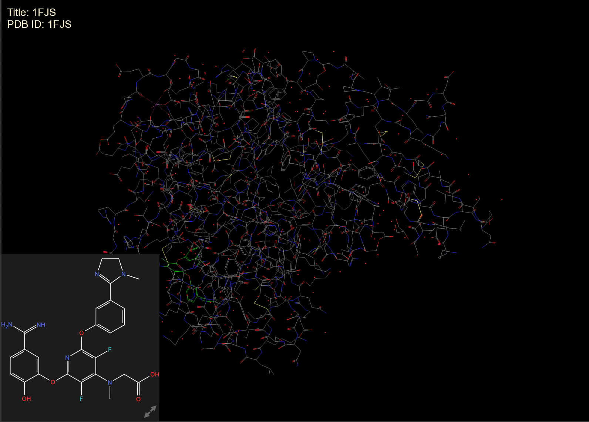
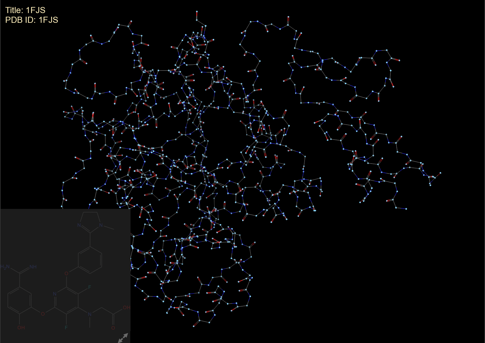
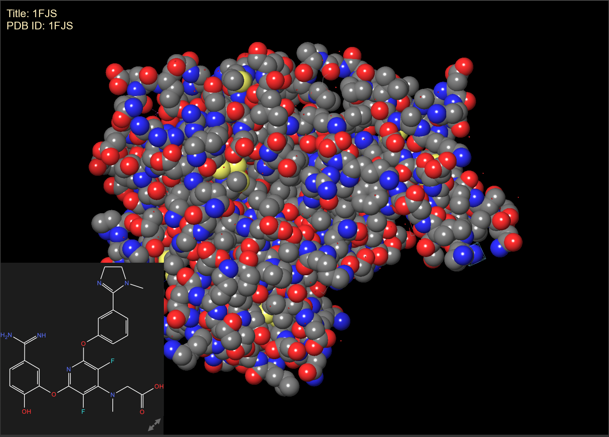
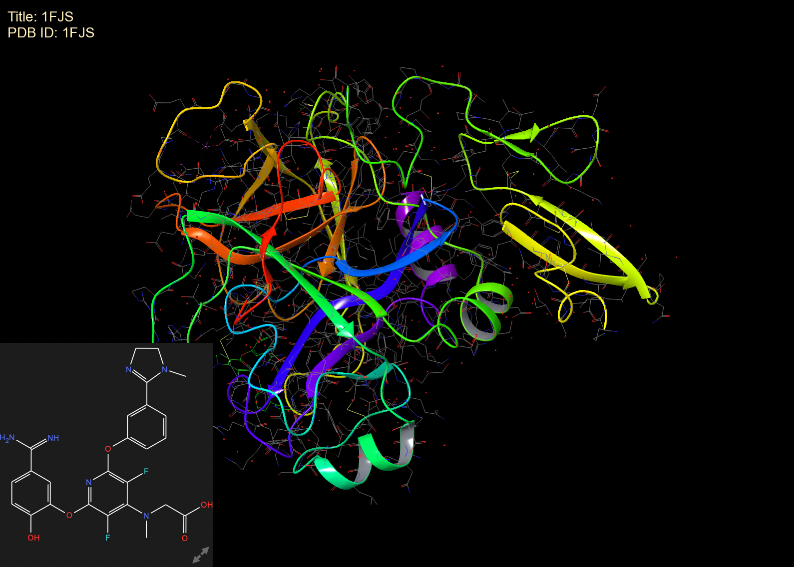
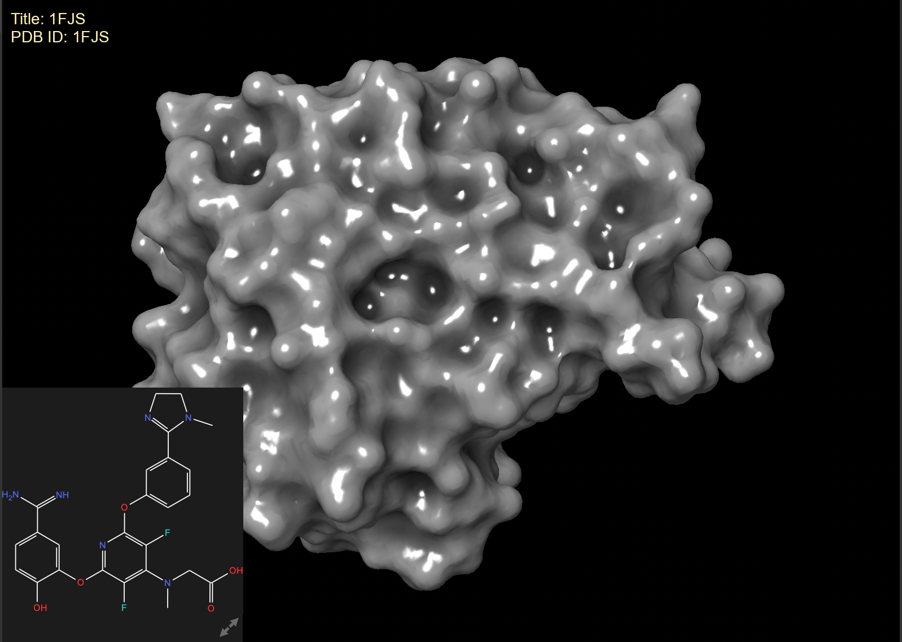
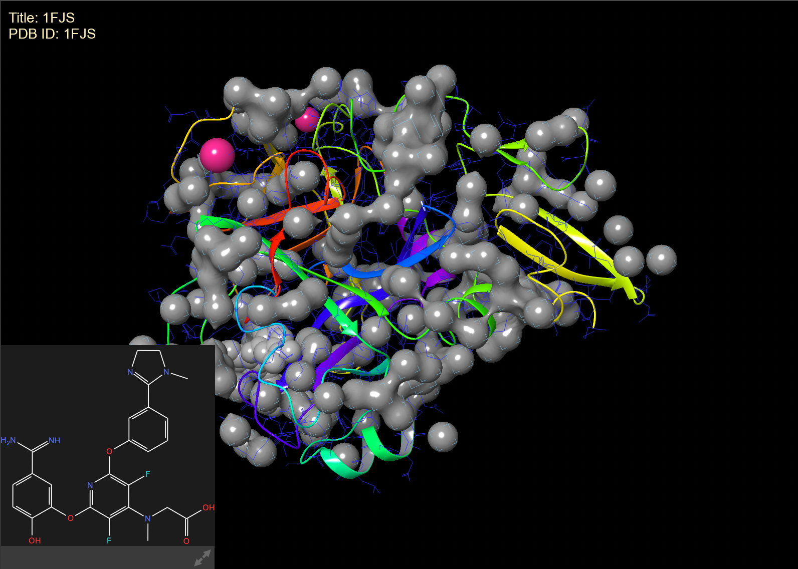

## Домашнее задание 5

### 1. ПО: https://www.schrodinger.com/downloads/freemaestro/complete
###    Выбранная структура белка: https://www.rcsb.org/structure/1FJS

### 2-3:
#### a) Wireframe (открывается по умолчанию когда подгружаешь белок)

#### b) Backbone (Во верхней панеле "Quick select:" нажать на многоточие и выбрать Backbone, после этого во вкладке "Style" нажать на кнопку "Display only selected atoms")

#### c) Spacefill (Во вкладке "Style" нажать на кнопку "Apply SPK representation")

#### d) Ribbons (Во вкладке "Style" нажать на кнопку "Ribbons")

#### e) Molecular sufrace (Во вкладке "Style" нажать на кнопку "Surface")

### 4: Раскраска структуры разными цветами по частям белка

