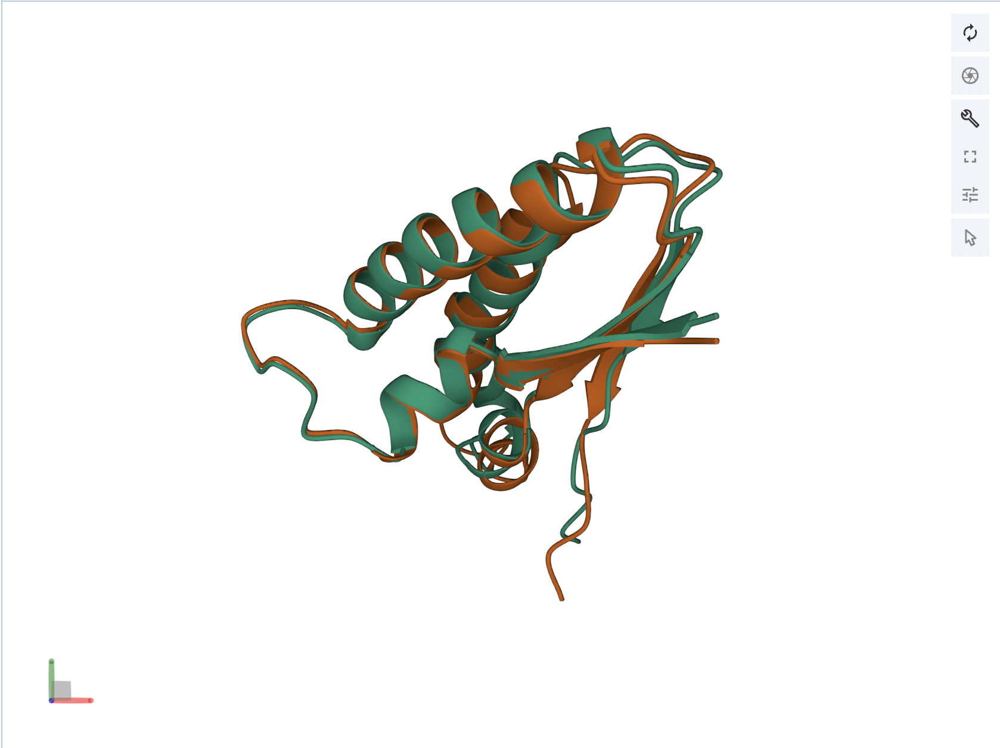

#### Последовательность:
MKGMLTGPVTILNWSWPREDITHEEQTKQLALAIRDEVLDLEAAGIKIIQIDEAALREKLPLRKSDWHAKYLDWAIPAFRLVHSAVKPTTQIHTHMCYSE

#### Программы предсказатели:
[AlphaFold2](https://colab.research.google.com/github/sokrypton/ColabFold/blob/main/AlphaFold2.ipynb)
[ESMFold](https://colab.research.google.com/github/sokrypton/ColabFold/blob/main/ESMFold.ipynb)

#### Программа-выравниватель: [LovoAlign](https://www.ime.unicamp.br/~martinez/lovoalign/align/index.html)

### Результаты
1. Полученные ноутбуки с предсказанной структурой:
[alphaFold](./notebooks/AlphaFold2.ipynb)
[esmFold](./notebooks/ESMFold.ipynb)
2. Полученные предсказания структур в формате PDB
[alphaFold](./predictions/AlphaFold2.pdb)
[esmFold](./predictions/ESMFold.pdb)
3. Результаты программы выравнителя

4. Визуализация результатов в программе https://www.rcsb.org/3d-view/

По раскраске по цепям видно, что предсказания близки друг к другу 
